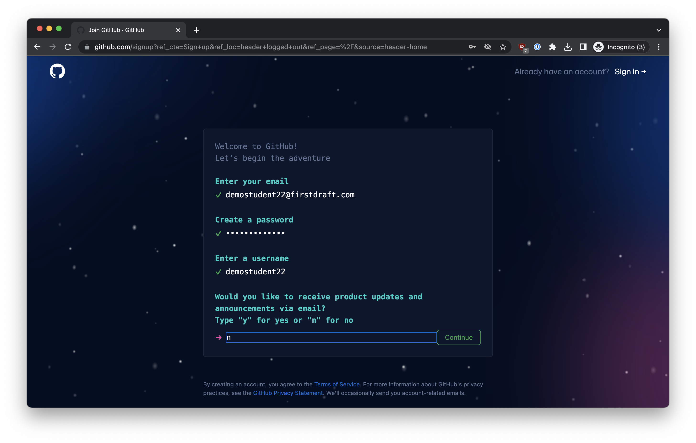
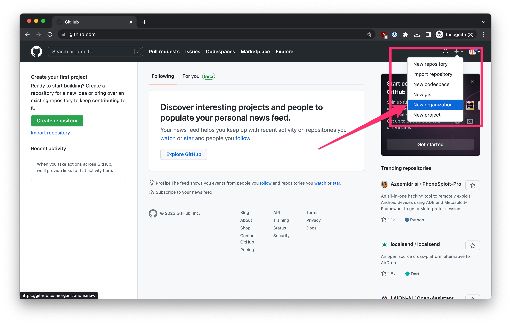
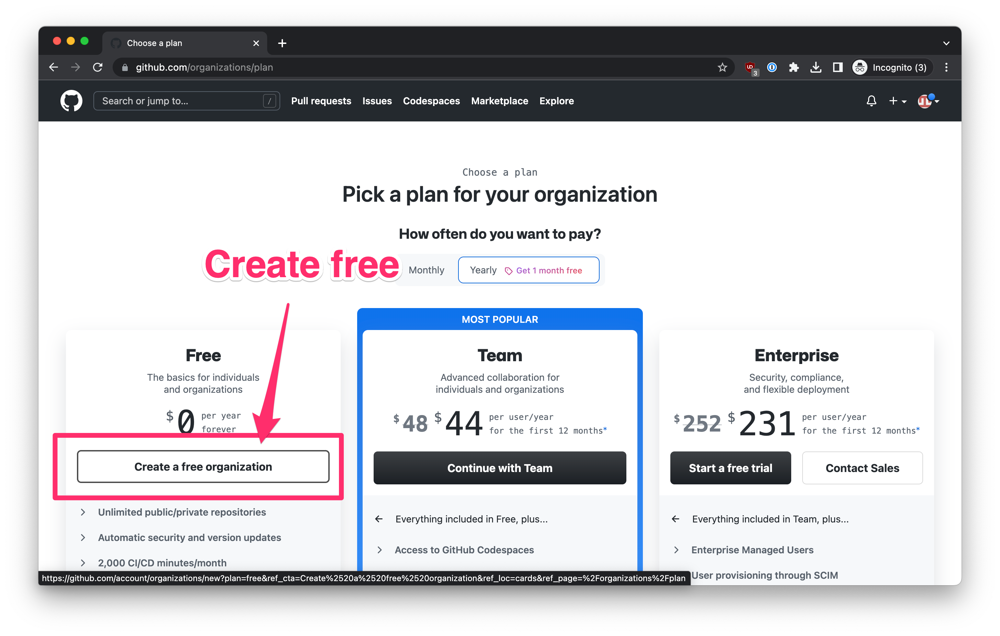
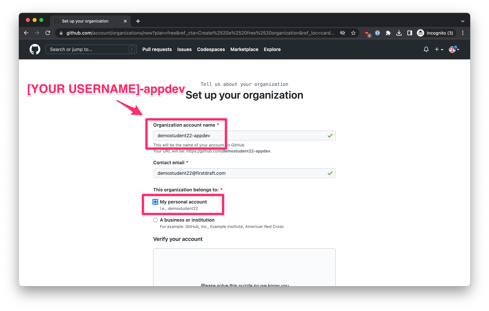

# Sign up for a GitHub account

GitHub.com has become the center of the software development universe. It is where most teams store and collaborate on their code. We'll be using it for almost everything we do.

Please sign up for an account (if you already have an account, you can skip this step):

Click [here](https://github.com/signup).
Enter your email address, choose a password, and choose a username:

Verify that you are a human and create.
On the next screen, you can "Skip personalization".
That's it for creating an account!
 

Next, you need to create an organization. An organization is sort of like a folder that we'll use to store all your class projects under.

Click the + in the top-right corner, and then select "New organization".

On the next screen, select "Create a free organization":

Choose a name for your organization. It can be anything, but most people make it [YOUR USERNAME]-appdev (replace [YOUR USERNAME] with the username you chose above):

On the next screen, "Skip personalization", and you should be done!
As your submission for this assignment, enter the GitHub username that you chose, as well as the name of the organization that you created.