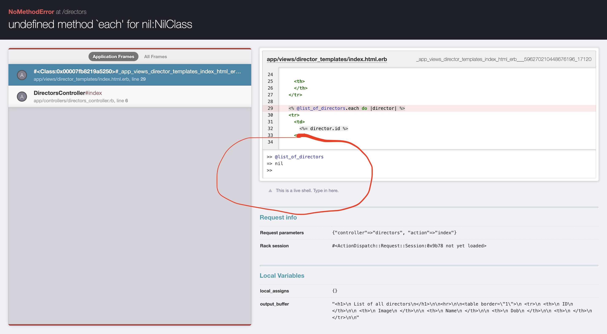

# A History Lesson

- Imagine being a villager living in Melanesia, circa 1940.


<small>[image source](https://www.worldatlas.com/articles/which-countries-and-territories-make-up-melanesia.html)</small>


---

# A history lesson
- You're living a lifestyle that has largely remained unchanged for thousands of years.
- Fishing and gathering are primarily how you make a living. Things are tight, but generally good.
- Sometimes there are violent clashes with neighboring tribes.
- Any illness or serious injury usually results in death.

---

# A history lesson
- One day, something strange happens.
- Directly above, around, and in your village, the largest war ever fought by humans takes place — World War II.
- The most technologically advanced nations in the world start building bases on your island.
- Soldiers arrive in planes, gliding down and landing on runways, and take up residence in the bases. But they don't fish or gather.
- To supply these bases, planes would airdrop cargo containing food, weapons, medicine, and other supplies.

---


---

# A history lesson
- This cargo is unlike anything you've ever seen.
- The food is unbelievably nutritious. One package could feed your family for a month.
- The weapons would make your tribe invincible.
- The medicines are miraculous life savers.

---

# A history lesson
- Then, one day, the conflict ends.
- The soldiers abandon their bases and runways. They take their planes and leave.
- The cargo stops being airdropped.
- People start dying from trivial injuries again.
- What do we need to do to get access to similarly nutritious food and effective medicine?

---

# A history lesson
- Well, back when the airdrops were coming, there were planes sitting by the runways.
- Now there are no planes.
- Maybe it's the presence of planes that causes the cargo to come?

---


---

# A history lesson
- Believing cargo to be blessings from the gods, "cargo cults" formed.
- They would build planes out of wood, uniforms out of straw, and perform the rituals that they had observed the soldiers performing.
- Some of these cults lasted for decades.

---

# A history lesson
- Why do you think I'm telling this story?

---

# Copy-paste
- Copy-pasting is a double-edged sword.
- It's great for avoiding typos, e.g.,
    - access tokens
    - URLs
- However, when you copy-paste code from one context to another, it will not work unmodified.
- The different context is, by definition, solving a different problem — or it wouldn't exist.

---

# Copy-paste
- The different context won't have the same params, instance variables, etc.
- If you don't understand why and how the code was working in the original context, copy-pasting it into your new and different context will just introduce lots of bugs and make it harder to make progress.
- This is known as ["cargo-cult programming"](https://en.wikipedia.org/wiki/Cargo_cult_programming).

---

# Copy-paste
- Even if it would work unmodified, you should still type it out when you're a beginner. Typing out code is essential for developing your own muscle memory.
- With experience, you will develop intuition for when it's okay to copy-paste and when it isn't.
- For now, when in doubt, err on the side of typing out code.

---

# Work in tiny little steps
- When you're solving a problem, don't try to jump all the way to the end in one go.
- What is a series of small steps that will get you to your goal?
- Figuring tiny steps to get from the starting point to the solution is engineering.

---
# Make the Invisible Visible

- Start small. What's the first thing you can print?
```ruby
puts "My var here: #{my_var}"
```
- Print things constantly to verify that each step did what you thought it did.

---
# Make the Invisible Visible

- Make instance variables and embed them in the view. You can delete them later.
```
<%= @my_variable.inspect %>
```

---
# Make the Invisible Visible

- If there's an error page, use the interactive console to display the contents of params, variables, and to experiment with potential solutions for the error.



---

# Make the Invisible Visible
- **Read** the server log. (Clear it often ⌘+k)

```
Started GET "/directors" for 130.126.255.106 at 2023-05-04 21:50:42 +0000
   (0.2ms)  SELECT sqlite_version(*)
Processing by DirectorsController#index as HTML
  Rendering director_templates/index.html.erb within layouts/application
  Director Load (0.6ms)  SELECT "directors".* FROM "directors" ORDER BY "directors"."created_at" DESC
  ↳ app/views/director_templates/index.html.erb:29
  Rendered director_templates/index.html.erb within layouts/application (Duration: 7.6ms | Allocations: 5127)
Completed 200 OK in 13ms (Views: 9.7ms | ActiveRecord: 1.5ms | Allocations: 7634)

```

---

# Try pseudocode first
- Try writing out your steps in comments

```ruby
def show
  # get id from params
  # use id to get record from db
  # make record accessible using instance variable
  # render template
end
```


---

# Try `debugger`

- Add `debugger` anywhere in your code to stop execution and inspect variables
    - `c` to continue
    - `n` to execute next line
- it even works in `html.erb` files!
    - `<% debugger %>`

---
# Restart / Refresh

- Try restarting your server or refreshing the page
- Configuration and settings are only set on server boot
- Your views are only reloaded when refreshing the page


---

# Use [ask.firstdraft.com](https://ask.firstdraft.com)
* It's great to have a conversation to help talk through a problem
* Remember, AI can be totally wrong
* It's best to not just copy paste AI output

---
# "How to Solve It"

1. First, you have to understand the problem.
2. After understanding, make a plan.
3. Carry out the plan.
4. Look back on your work. How could it be better?


---

# Understand the problem

Try asking yourself (and each other) the following questions:
- What are you asked to accomplish?
- Can you restate the problem in your own words?
- Can you think of a picture or a diagram that might help you understand the problem?
- Is there enough information to enable you to find a solution?
- Do you understand all the words used in stating the problem?
- Do you need to ask a question to get the answer?

---

# Thank you