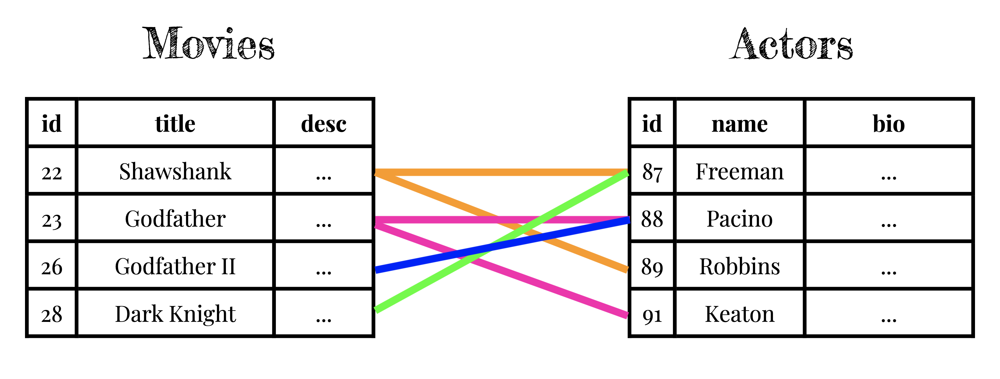

<!-- SOURCE: https://firstdraft.slides.com/raghubetina/dpi-01 -->

# Welcome 😁
* Thank you embarking on this journey with us.
* Please find and open the link to this slide deck in Canvas
* Please visit this URL now: [https://pollev.com/ianheraty201](https://pollev.com/ianheraty201)
* If you already have an account, sign in. Otherwise it may ask you to sign up, or it may just ask you for a name. Please use something that matches your name in Canvas so we can give you credit.
* **There are no wrong answers for the PollEv exercises**.

---

# Let's get to know each other!
* Please form groups of 3-4 with people sitting around you, and share:
* Your name.
* Where you're from and which neighborhood you live in now.
* Why did you sign up for this course?
* What's one thing you like to geek out about? (hobby, place, tv show, food; anything.)
* Compare schedules/locations for potential study buddies.

---

# Questions
* This course is question-driven.
* We need you to ask questions.
* Speak up whenever you feel like it, or raise your hand.
* If you're not sure whether it's relevant to everyone, wave over a TA and ask them; they'll decide and escalate.
* Outside of class, our rule: You're only allowed to get stuck for 15 minutes before asking a question.
* I'll be posted up in the class room, Slack, and Piazza.
* The course is organized according to the the lock-before-key principle; sometimes until someone asks the question, I won't provide the info needed to solve an exercise.

---

<!-- POLL -->
<!-- Previous Programming Experience -->
<!-- Which of the following describes you? Select all that apply. -->

<iframe src="https://pollev-embeds.com/multiple_choice_polls/aQxp4cc7UQMBB34UrnPQK/respond" width="1100px" height="600px"></iframe>

---

<!-- RESPONSE -->
<!-- Previous Programming Experience -->
<iframe src="https://embed.polleverywhere.com/multiple_choice_polls/7MvmMS844GpNhC6C432r4?controls=none&short_poll=true" width="1100px" height="600px"></iframe>

---

# the term "app"
* There are three kinds of software:
  * "system software" (like Windows and MacOS)
  * "utility software" (like the system clock or clipboard)
  * "application software" — software that people ("users") use directly to achieve some specific goal. (eg a word processor or a social network)
* In this course, whenever you hear me say "app", what I mean is "application software".
* Nowadays many people, when they say "app", mean a native app (something that you download from Apple's App Store or Google's Play Store and interact with through your phone's touch screen); but we'll use the term more broadly, to mean "application software", in this course.
* Our definition of "app", application software, is independent of interface; which means that it encompasses native phone apps, native desktop apps, web apps (used within a web browser), and more.

---

# What does it mean to know "how to code"?
* If you said "yes" to any of the questions in the prior programming experience survey, do you consider yourself someone who knows "how to code"?
* If someone has:
  * set up a landing page with Wix
  * a blog with Wordpress
  * or a store with Shopify
  * done data analysis with R or Stata
  * scraped websites with Python or Ruby
  * has written C++ or Java for a CS course
* ​does that mean they "know how to code"?

---

# What does it mean to "know how to code"?
* There are so many different kinds of software — it's like saying you want to "learn science".
* I think when people say they want to learn "how to code," what they generally mean is that they want to be able to build the kind of software that they themselves use on a daily basis.
* Naturally, this is the kind of software that they are most familiar with.
* If they are the entrepreneurial type, if they have ideas, these are the kind of ideas they'll have and want to implement.

---

# What does it mean to "know how to code"?

"**Knowing how to hack** also means that **when you have ideas, you'll be able to implement them**.... It's a big advantage, when you're considering an idea like putting a college facebook online, if instead of merely thinking 'That’s an interesting idea,' you can think instead '**That’s an interesting idea. I’ll try building an initial version tonight.**"

— Paul Graham, "How to Get Startup Ideas"

---
# What does it mean to "know how to code"?
* What kind of software (excluding system and utility software) do you use most often?
  * R scripts for data analysis?
  * Python web scrapers?
  * Embedded C programs to run hardware devices?
* Possibly, but for most people probably not the above (at least not directly).
* How about Adobe Photoshop? Nintendo Switch games? Alexa Skills?
* Those are a bit closer to daily life.
* Which apps do you use most at work or school? When you're out with friends?

---

<!-- POLL -->
<!-- Which software applications do you use most frequently? Let's exclude email, utilities (like the Clock), and system software (like Android, iOS, Windows, MacOS, etc). -->
<iframe src="https://pollev-embeds.com/free_text_polls/QIKKISrOR8MfTaCiODS5N/respond" width="1100px" height="600px"></iframe>

---

# The kind of software applications that I use most frequently look like this...

<video controls width="1000px">
  <source src="https://media.slid.es/videos/318017/DFU5XJsq/airbnb_2-1143.mp4" type="video/mp4">
</video>

---

"More and more major businesses and industries are being run on software and delivered as online services — from movies to agriculture to national defense.

Many of the winners are Silicon Valley-style entrepreneurial technology companies that are invading and overturning established industry structures.

Over the next 10 years, I expect many more industries to be disrupted by software, with new world-beating Silicon Valley companies doing the disruption in more cases than not."

— Marc Andreesen, "[Why Software Is Eating the World](https://a16z.com/2011/08/20/why-software-is-eating-the-world/)" (2011)

---

# Rather than "Why Software Is Eating The World"
  * Why Internet-Delivered Software Is Eating The World
  * Why "Cloud"-Based Software Is Eating The World
  * Why Software-As-A-Service (SaaS) Is Eating The World

---

# Which software applications do you use most frequently?

<!-- RESPONSES -->
<!-- Which software applications do you use most frequently? -->
<iframe src="https://embed.polleverywhere.com/free_text_polls/CfUIsPrcx7bUKArWrf66G?controls=none&short_poll=true" width="1100px" height="600px"></iframe>

---

# We're going to learn how to build SaaS

* Not system software or utility software.
* Not 3D games.
* Not applications that are installed and run on a single device, without any communication to the outside world.
* We're building Software-as-a-Service (or "SaaS", or "cloud-based software") that delivers useful information to users over the internet, via URLs.
* At first, we'll focus on delivering that information through a web browser. Later, we can add other interfaces — iPhone, Android, Apple Watch, Alexa, etc.
* Not only are cloud-based apps a relatively straightforward class of software for beginners to cut their teeth on, it's a super-useful class of software — so much so that it's eaten the world!

---

# The world now turns around the humble...

---

# URL

Uniform Resource Locator

---

# Step 1: Type in a URL

(or the equivalents: click on a link, submit a form, tap on something, etc)

---

# Step 3: Profit!

(get back information that is relevant and valuable to me)

---

# Step 2:

---

# Sounds good, but who are you?
* Hi! I'm Ian
* Back in 2012 I was living in Shenzhen, China teaching English
* I wanted to to learn "how to code".
* Specifically, I wanted to build an iOS app — but I didn't know anyone who knew how or what to learn to get there.

---

* Tried learning from books
  * c#
  * arduino
  * objective-c
* Massive Open Online Courses
  * Harvard CS50
  * Treehouse
  * Make School

---

"That’s exactly the thing that will turn people away from programming forever,” he said. “It’s like teaching someone chemistry as the first thing if they want to learn how to paint."

— Raghu Betina, on teaching CS to people who want to learn application development

---

# Okay, if not CS, then what should we start with if we want to learn how to write SaaS?

---

"On the back end, software programming tools and Internet-based services make it easy to launch new global software-powered start-ups in many industries — without the need to invest in new infrastructure and train new employees.

In 2000, when my partner Ben Horowitz was CEO of the first cloud computing company, Loudcloud, the cost of a customer running a basic Internet application was approximately $150,000 a month. Running that same application today in Amazon’s cloud costs about $1,500 a month."

— Marc Andreesen, "Why Software Is Eating the World" (2011)

* By the end of this course, you'll know how to do this for $17/month

---

* There were many things coming together in the 2000s to make SaaS companies ever cheaper to build and launch — datacenters for rent, the open-source movement, modern high-level languages and frameworks.
* It was not a coincidence that 2011 is also when coding bootcamps and online courses arose to fill the gap in developers that Computer Science departments were not addressing.
* Some of the same things that brought the cost of running a SaaS product down by two orders of magnitude are also why it became possible for beginners to build useful software from coding bootcamps and online courses.
* I heard about a few of these (Harvard CS50 / MakeSchool / Treehouse / Mobile Makers) and decided to give it a try while teaching in China.
* It worked! Finally, I learned "how to code" — I learned how to build the kind of software I had ideas for.

---

---

* I moved back to Chicago in 2016 and got an internship building port/intermodal terminal solutions at Mi-Jack. Got on the job experience writing python, .NET C#, and LOTS of technical documentation.
* Hired by Nerdery to build iOS apps. Moved over to web development react js and .NET C# backend due to need and willingness to learn.
* Founded [https://biggreen.company](https://biggreen.company), [https://popping.live](https://popping.live), and [https://receipt-ai.com](https://receipt-ai.com) all with Ruby on Rails

---

# Step 1: Type in a URL

(or the equivalents: click on a link, submit a form, tap on something, etc)

---

# Step 3: Profit!

(get back information that is relevant and valuable to me)

---

# Step 2:

---

# Not these kinds of things
* How to implement lists, starting from scratch (i.e., working with the physical memory of the computer).
* How to sort those lists.
* How to actually draw to the pixels of the screen.
* These are solved problems. We can focus on our ideas instead.

---
# These kinds of things
* Where to host our application, buy a domain name, etc.
* How to specify a list of URLs that people are allowed to visit.
* When someone visits a URL, how to retrieve the relevant resource that they trying to locate — usually from a database.
* How to make the information look nice with some formatting.
* This is what we'll learn, starting today.

---

# That still sounds like a lot to learn in a few weeks

---

* Did you know that the DNA of humans and chimpanzees is about 98% the same?
* Most of our DNA is the plumbing of being alive, being primates, etc.
* Only a tiny bit makes us distinct from chimpanzees.
* We have exactly the same 98% since we descended from a common ancestor, approximately 6-10 million years ago.

---

* Similarly, Twitter and Airbnb share 98% of their code.
* Most of any SaaS application are common plumbing:  having a web server, connecting to the database, etc.
* Only a tiny bit makes them distinct from one another — tweets instead of listings, etc.
* Twitter and Airbnb, too, have exactly the same core code; since they too had a common ancestor.

---

* In 2003, a Chicago entrepreneur (Jason Fried) hired a Danish programmer (David Heinemeier Hansson) to build an idea he had for project management SaaS. They called it Basecamp.
* David loved an obscure programming language called Ruby, which was invented in Japan in the mid 1990's. Ruby was slow, but expressive and "beautiful" (to David). Jason didn't really care what David used so he said 👍
* Once he got Basecamp working, David extracted the 98% of it that was common plumbing for all SaaS and released it for free, open-source. He called this package of Ruby code that let you quickly get a web application up and running "Ruby on Rails." It was, at the time, revolutionary.

---

* So this is going to be our hack:
* Much like Twitter, Airbnb, NYTimes, GitHub, and thousands of other companies, we're going to borrow David's (and, by now, thousands of other contributors') code.
* This will let us skip re-inventing tens of thousands of lines of code and many years of learning.
* We just need to learn enough of the Ruby language to be able to navigate Ruby on Rails, the framework. ("Framework" just means "a bunch of code we're borrowing".)
* This will be our strategy. For example, we'll learn just enough of another language, CSS, to be able to use a CSS framework called Bootstrap to make our pages look professional.
* In general, we will stand on the shoulders of giants.
---
# Play the whole game
* The crucial piece in finally making programming "click" is learning all the skills needed to deploy an application, not just one or two. I.e., we become **full-stack developers**.
* Most courses or books teach you one language or skill, but then you're left wondering how that fits in with the 99 other things you need to know in order to deploy an application.
* Making a real, functional application was motivating! It gave me a reason to continue learning — to improve it, and to make my next one.
* It gave me practical context to learn the stuff from CS courses that previously had no meaning for me.

---

# Learning how to learn
* Our real goal during these 12 weeks is not to learn Ruby, Rails, Bootstrap, or any other particular language or framework.
* These are good, beginner-friendly, motivating choices for an introductory course.
* Our real goal is to learn how to learn, so that you can then go on to learn whatever interests you.

---

# Learning how to learn
* Being a software developer means being a lifelong learner.
* There are always new languages, techniques, and frameworks to stay up-to-date on.
* Every single project involves learning new things, depending on what real-world problem you're being hired to solve.
* We are inventors. There are no formulas to look up and apply; we have to learn about the problem and then invent solutions.

---

# How the course will work
* Learning how to program from lectures is really hard.
* So many things to juggle — watching me, typing along, taking notes.
* Super easy to fall behind if you get stuck on something.
* Instead, we'll be using a partially "flipped" format. Instead of lectures, you'll have videos that you can pause, speed up, skip back, search, and reference whenever you want.
* During our class meetings, we'll do activities together to practice and reinforce what you learned from the videos and readings.
* M/W/F mornings — "class meetings". All the rest of the time (M/W/F afternoons, T/Th) is "lab" (with the exception of other seminars and guest lectures).
* There will be exceptions to this schedule, but that's the general plan.

---

# How the course will work
* Tomorrow, you should start your first assignment: **RPS HTML**. (You'll learn how to set up the tools you'll need to write code, write your first website, and deploy it to the internet so that other people can see it!)
* Friday morning we'll do activities together to reinforce and extend your learnings.
* During lab time, I will be posted up in the collab space next door.
* Please walk over and ask me (and the other instructors) lots of questions as you're working through the videos, readings, and projects.
* I may look like I'm busy on my laptop but I'm not. I'm there for one purpose only: waiting for you to come ask me questions.

---

# How the course will work
* Canvas is our home base.
* All of your work will be under "Assignments".
* I recommend always clicking "Show by Type" (instead of the default "Show by Date").
* Most assignments are required. Optional ones will have "(Optional)" in their title.
* Try to complete all required assignments before the next class meeting, so that you are prepared for the activities we do together. Assignments will have due dates that you should try to hit.

---

# How the course will work
* If you finish the required assignments, you should:
  * If you're feeling shaky about the required assignments, try doing them over from scratch. It should be easier the second time. Take notes on what's still confusing so we can discuss it during class.
  * If you're feeling very good about the required assignments, try the optional assignments to extend your learning.
  * Try applying the concepts you've learned to your own ideas. (Best possible way to learn.) I can bounce ideas with you.
  * Some students have reported watching the videos over again at 2x speed is helpful.

---

<!-- POLL -->
<!-- Questions break #1: do you have any questions about anything so far, anything at all? -->
<iframe src="https://pollev-embeds.com/discourses/T0jbxnp4j0k9KziZxEcEI/respond" width="1100px" height="600px"></iframe>

---

<!-- RESPONSES -->
<!-- Questions break #1: do you have any questions about anything so far, anything at all? -->
<iframe src="https://embed.polleverywhere.com/discourses/3P4m7BfhTFpCLvSepYK2V?controls=none&short_poll=true" width="1100px" height="600px"></iframe>

---

# Okay, so, out of all the stuff we have to learn: where to begin?

---

---

# The foundation of the world back then was the written word

---

---

---

# The foundation of the world today is software

---

---

---

---
# What were they writing?

---

# The first person whose name we know

---

<!-- POLL -->
<!-- Who was the first person whose name we know? -->
<iframe src="https://pollev-embeds.com/free_text_polls/XsLv7lejgVt7DMRulzrJ0/respond" width="1100px" height="600px"></iframe>

---

<!-- RESPONSES -->
<!-- Who was the first person whose name we know? -->
<iframe src="https://embed.polleverywhere.com/free_text_polls/TnRoObl1EWMEn5w9q0aC2?controls=none&short_poll=true" width="1100px" height="600px"></iframe>

---

# "29,086 measures barley; 37 months — Kushim"

---

"It is telling that the first recorded name in history belongs to an accountant, rather than a prophet, a poet, or a great conqueror."

— Yuval Noah Harari, Sapiens: A Brief History of Humankind

---

## What were they printing?

## What was the best-selling book?

---

<!-- POLL -->
<!-- What was the second best-selling book (after the Bible)? -->
<iframe src="https://pollev-embeds.com/free_text_polls/EXYv5O7qq3c5CwXU3imfk/respond" width="1100px" height="600px"></iframe>

---

<!-- RESPONSES -->
<!-- What was the second best-selling book (after the Bible)? -->
<iframe src="https://pollev-embeds.com/free_text_polls/EXYv5O7qq3c5CwXU3imfk/respond" width="1100px" height="600px"></iframe>

---

* In the 17th century, English almanacs were bestsellers, second only to the Bible

* An almanac is an annual publication that includes information such as:
   * weather forecasts
   * farmers' planting dates
   * tide tables
   * tabular information often arranged according to the calendar.

---

# The killer application of writing, and printing, was recordkeeping

---

# The killer application of computing is also recordkeeping

---

* The heart of any application is the information it is keeping track of.
* Users, tweets, and who-follows-who in Twitter.
* Listings, bookings, and messages in Airbnb.
* Venues, reviews, and ratings in Yelp.

---

# IN THE BEGINNING, THERE WAS CRAIGSLIST
A categorized list of records

---

* We keep track of this information as records in plain old tables — just like they did in almanacs in the 17th century.
* One of the most important parts of application development is figuring out what information we need to keep track of, and a good set of tables to organize that information.
* This is part of the process known as data modeling (or "database design" or "database architecture").
* This is usually not taught in intro courses! But, it's the most important and most challenging part of app development.
* It's an art, not a science. We'll spend time every week practicing. Let's dive in!

---

# Databases
* A "database" is the software we use to store information. It is just a set of 2D tables; don't let the fancy name throw you. It's like a clipboard; or, an Excel workbook, where each table is one sheet.
* However, I don't want you to think about databases as software at all. Try to think of them as just paper, like almanacs.
* Whatever information we need to power our applications, we need to be able to figure out a way to store it in 2D tables, as if we were storing them in paper tables.
* And whatever logic we need to solve our users' problems with that information, we have to be able to describe how we'd do it as humans, given paper tables.
* Computers are just faster at doing it than us, but it will be the same operations — looking up data that's relevant to a certian user, ordering things in certain way, filtering things by certain criteria, etc.

---
# One approach to database design
* We (the developers) figure out the main things, or nouns, in our problem space and make a table for each.
* We add columns to each table for each attribute of the thing we need to keep track of.
* Our users create (or read, or update, or delete) rows.
* We say "create, read, update, or delete" so often — these are the fundamental 4 operations that all user actions map to — **CRUD**.
* 80%+ of the functionality of most SaaS applications is **CRUD**. This is what we will focus on learning how to build.

---

# Caveat #1
* Our users actions should not trigger creating tables or columns; only rows. We, the developers, will create all tables and columns up front, when we design and deploy the application.
* Users can **CRUD** a million rows per second if they want to. They just can't add tables or columns.

---

# Caveat #2

* **We will only store one value per cell.**
* A value can be a long blob of text, like a bio; but it can't be *multiple* bios for different people.

---
# Must See Movies

* Okay, this is all pretty abstract. Let's look at some examples.
* Lets examine an [application](https://msm-associations-target.herokuapp.com/) that we'll build in class. It's a very simplified version of the iMDB (the Internet Movie Database).
* Click around it for a minute. Observe and identify:
* How are the URLs named? What is indicated by each part of the URL?
* What all information is being stored and displayed on each page?
* If you had to design tables to store all of the information required to power that app, what would they be? What columns would they have? Think of questions.
* Let's experiment on the whiteboard.

---
<!-- SOURCE: https://firstdraft.slides.com/ianheraty/dpi-day-1#/82 -->

# Movies

|id|title|desc|director_name|director_bio|director_dob|
|-|-|-|-|-|-|
|22|Shawshank|...(long)|Darabont|...(long)|28-Jan-1959|
|23|Godfather|...(long)|Coppola|...(long)|07-Apr-1939|
|26|Godfather II|...(long)|Coppola|...(long)|07-Apr-1939|
|28|Dark Knight|...(long)|Nolan|...(long)|30-Jul-1970|

---

# Movies

|id|title|desc|director_name|director_bio|director_dob|actors|
|-|-|-|-|-|-|-|
|22|Shawshank|...(long)|Darabont|...(long)|28-Jan-1959|Freeman, Robbins|
|23|Godfather|...(long)|Coppola|...(long)|07-Apr-1939|Pacino, Keaton|
|26|Godfather II|...(long)|Coppola|...(long)|07-Apr-1939|Pacino|
|28|Dark Knight|...(long)|Nolan|...(long)|30-Jul-1970|Freeman|

---

# Movies

|id|title|desc|director_name|director_bio|director_dob|actors|actor_bios?|
|-|-|-|-|-|-|-|-|
|22|Shawshank|...(long)|Darabont|...(long)|28-Jan-1959|Freeman, Robbins|😭|
|23|Godfather|...(long)|Coppola|...(long)|07-Apr-1939|Pacino, Keaton|😭|
|26|Godfather II|...(long)|Coppola|...(long)|07-Apr-1939|Pacino|😭|
|28|Dark Knight|...(long)|Nolan|...(long)|30-Jul-1970|Freeman|😭|

---

---

---

---

---

---

# Next up:

Records & Relationships:

<!-- TODO: add links to slides -->

