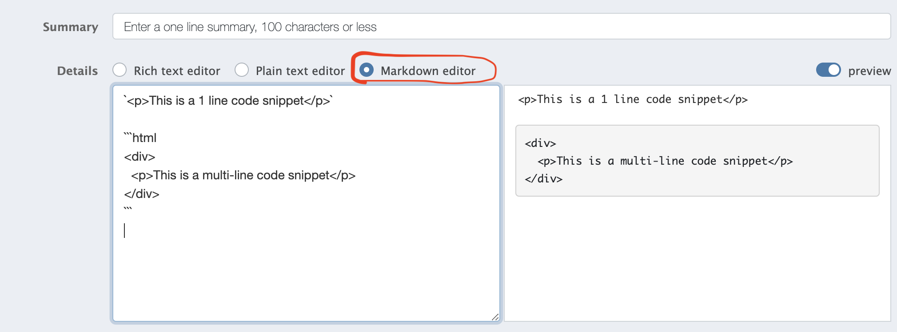

# Asking Questions

Most of your programming work will be done at your own pace, during lab time

Learning occurs through *asking questions*

Remember the **15 Minute Rule**

You're only allowed to get stuck for 15 minutes before you ask a question. 

Don't spin your wheels for longer than that!

---

# Asking Questions

When you have a question, instead of raising your hand or finding one of us, we want you to first type up your question on Piazza.

Why?

1. writing out what you're struggling with will often help you solve it yourself

2. Writing well is an essential component of succeeding as a software engineer (remote work, stack overflow, GitHub etc.)

---

# Asking Questions

1. State the problem you're working on
2. What is your code doing right now?
3. What do you want it to be doing instead?
4. Copy-paste the snippet(s) of code that you think are relevant.
5. Describe what you've tried so far to resolve.

---

# Code Snippets 👨‍💻

Please use markdown code snippets when sharing pieces of code

---

# Answering Questions

Keep an eye on Piazza and try to help your classmates

After you solve your problem, please update your question with the answer

---

# Participation 🏆

Piazza participation is a component of your overall evaluation/"grade"

We keep track of:
1. Number of questions you've asked (this is the most important metric)

2. Number of other peoples' questions you've read (2nd most important metric)

3. Number of other peoples' questions you've answered

---

# In Review

Even though it's weird to be asking & answering questions on a forum when we're all sitting in the same room, please give it a try.

Trust us, it greatly improves learning and retention to write first and then talk it through.

