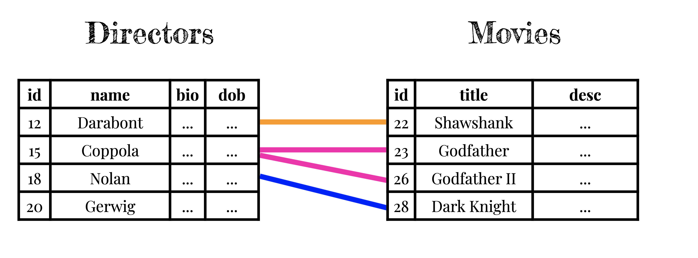
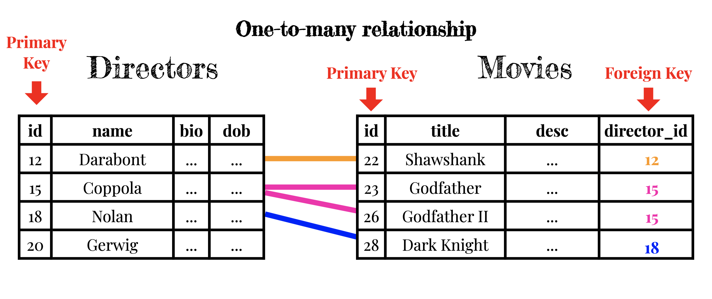
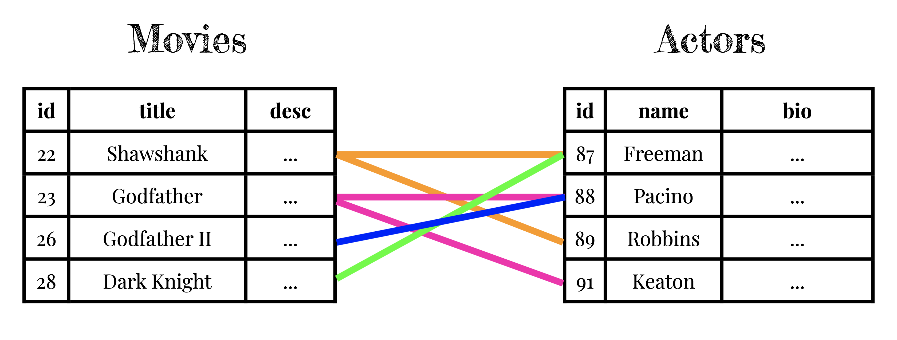
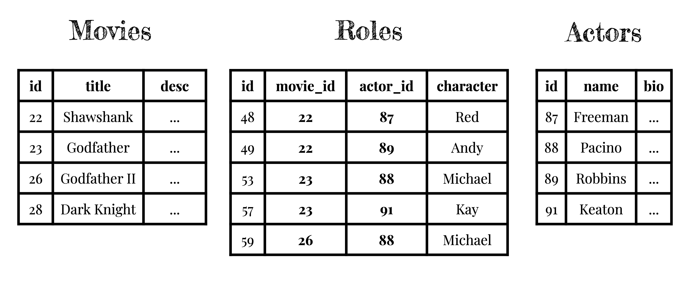

# Data Modeling

What information does the application need to keep track of?

* Where is that information coming from?
  * users?
  * government dataset?
  * etc.

* How would I keep track of that information on paper?
  * could I answer the "question" that each feature represents by looking through my tables?

Computers can't do anything that we couldn't do by looking through paper tables

---

# Caveat #1

We can't add tables or columns while recordkeeping. We (the developers) create all of the tables and columns up front.

After we deploy the app, users only **create**, **read**, **update**, and **delete** (CRUD) rows in our tables.

Users can CRUD a million rows per second if they want to. They can't add any tables or columns.

---

# Caveat #2

We can only store one value per cell.

A value can be a long blob of text, like a bio; but it can't be multiple bios for different people.

1. This will save a lot of trouble when it comes to retrieving the values later, and having to figure out where one value ends and the next one begins.

2. There are other important reasons to avoid multiple values in a single cell as well.

---

---

---

---

---

---

# Answer the following questions by referring to the four tables in the database:

(show your work)

1. Who directed The Shawshank Redemption?
2. How many actors were in The Shawshank Redemption?
3. What films has Morgan Freeman been in?

---
# Directors

|id|dob|name|bio|
|-|-|-|-|
|17|1966|Kátia Lund||
|5|July 30, 1970|Christopher Nolan|Best known for his cerebral...|
|2|April 7, 1939|Francis Ford Coppola|He was born in 1939 in Detr...|
|1|January 28, 1959|Frank Darabont|Three-time Oscar nominee Fr...|

---
# Movies

|id|title|year|director_id|
|-|-|-|-|
3|The Godfather: Part II|1974|2|
6|The Dark Knight|2008|5|
21|City of God|2002|17|
2|The Godfather|1972|2|
1|The Shawshank Redemption|1994|1|

---
# Actors

id|dob|name|bio|
|-|-|-|-|
271|April 15, 1983|Alice Braga||
269|June 8, 1970|Seu Jorge||
263|May 21, 1983|Alexandre Rodrigues	
79|May 25, 1976|Cillian Murphy|Striking Irish actor Cillia...|
77|September 7, 1977|Monique Gabriela Curnen|Monique Gabriela Curnen is ...|
76|March 21, 1958|Gary Oldman|Gary Oldman, the son of a w...|
75|November 16, 1977|Maggie Gyllenhaal|Academy Award-nominated act...|
72|April 4, 1979|Heath Ledger|When a young, hunky 20 year...|
71|January 30, 1974|Christian Bale|Christian Charles Philip Ba...|
31|August 17, 1943|Robert De Niro|Robert De Niro, who is thou...|
27|April 25, 1946|Talia Shire||	
25|January 5, 1946|Diane Keaton|Diane Keaton was a Californ...|
24|February 24, 1928|Al Lettieri|Menacing looking Italian Am...|
20|January 5, 1931|Robert Duvall|Veteran actor and director ...|
17|April 25, 1940|Al Pacino|Known for his forceful dram...|
2|June 1, 1937|Morgan Freeman|With an authoritative voice...|
1|October 16, 1958|Tim Robbins|Born in West Covina, Califo...|

---

# Characters

|id|name|movie_id|actor_id|
|-|-|-|-|
306|Angélica|21|271|
304|Mané Galinha - Knockout Ned|21|269|
298|Buscapé - Rocket|21|263|
85|Scarecrow|6|79|
83|Ramirez|6|77|
82|Lucius Fox|6|2|
81|Gordon|6|76|
80|Rachel|6|75|
77|Joker|6|72|
76|Bruce Wayne|6|71|
36|Connie Corleone|3|27|
34|Vito Corleone (as Robert DeNiro)|3|31|
33|Kay|3|25|
32|Tom Hagen|3|20|
31|Michael|3|17|
27|Connie|2|27|
25|Kay Adams|2|25|
24|Sollozzo|2|24|
20|Tom Hagen|2|20|
17|Michael Corleone|2|17|
2|Ellis Boyd 'Red' Redding|1|2|
1|Andy Dufresne|1|1|

---

# Yap (Yelp clone)
Please visit [this application](https://yap.matchthetarget.com/).

You can sign in with any of the following (all of their passwords are 'password'):

alice@example.com
bob@example.com
carol@example.com
doug@example.com
ellen@example.com    (Ellen is an admin user, so you'll notice some extra capabilities)

---

# Try to design a database for Yap

You can use pen and paper, a shared Google Sheet, or any other medium you prefer to write down your tables.

Try to think of what the main **entities** are; these are candidates for tables.

What **attributes** of each entity will you need to store? These are candidates for columns.

Identify any **1 to Many** or **Many to Many** relationships so that you can add any necessary foreign keys and join tables.

Test your design by adding some "sample records" to your tables (a few users e.g. "alice", "bob"; a few places; a few reviews; etc) to your tables, and make sure that you can record everything required for all actions in the app.
