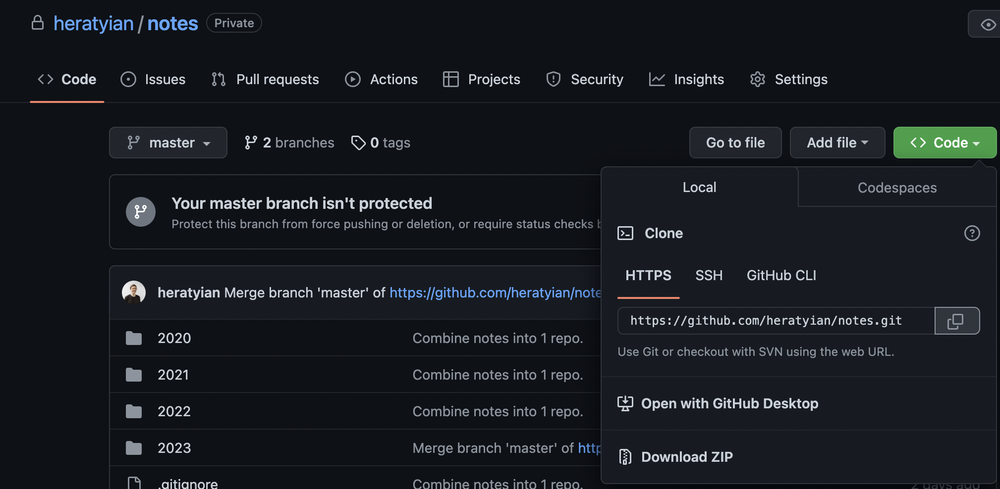

# Git Remote and GitHub

---

# TODO

✅ setup git to track changes in your `notes/` directory

(you will need install xcode command line tools `xcode-select --install`)

see [version control with git](./version-control-with-git/index.html)

✅ push your notes to a remote repository on GitHub


---

# Create Repository on GitHub



[Create New Repository](https://github.com/new)


---
# Create Personal Access Token

<!-- https://docs.github.com/en/authentication/keeping-your-account-and-data-secure/creating-a-personal-access-token#creating-a-personal-access-token-classic -->


---
# Using a personal access token on the command line

<!-- https://docs.github.com/en/authentication/keeping-your-account-and-data-secure/creating-a-personal-access-token#using-a-personal-access-token-on-the-command-line -->

---

# macOS Keychain


---

# create a new repository on the command line

```
echo "# test-repo" >> README.md
git init
git add README.md
git commit -m "first commit"
```

---

# push an existing repository from the command line

```
git remote add origin https://github.com/heratyian/test-repo.git
git branch -M main
git push -u origin main
```

---

# Push to GitHub

1. Create a new 'remote' repository in GitHub

2. Add remote repository to your local git
`git remote add origin <repository_url>`

3. Push your local git repository to the remove
`git push -u origin main`


