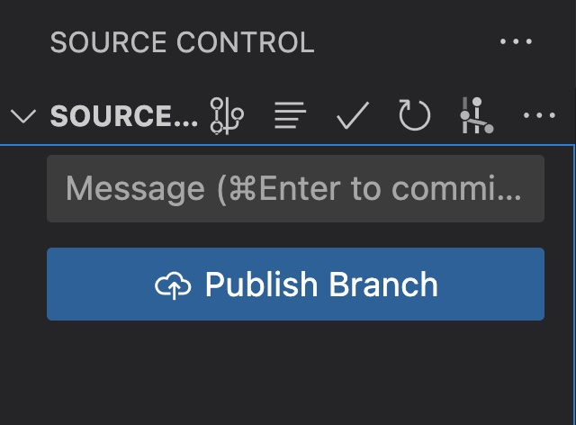

# Git Remote and GitHub

---
# TODO

✅ push your notes to a remote repository on GitHub


---
# Scenario

1. Working on a project 👨‍💻
2. Want to go home and work on it from a different computer 🏠
3. How can we share the latest version of your project? 🤨


---
# Create Repository on GitHub

[Create New Repository](https://github.com/new)


---

# Add remote and push (CLI)

```
git remote add origin <your-repository-url.git>
git branch -M main
git push -u origin main
```

---

# Create remote repository and push (VSCode)



Follow wizard to create a new repository and push

---

# Resources

[Create personal access token](https://docs.github.com/en/authentication/keeping-your-account-and-data-secure/creating-a-personal-access-token#creating-a-personal-access-token-classic)

[Using personal access token in CLI](https://docs.github.com/en/authentication/keeping-your-account-and-data-secure/creating-a-personal-access-token#using-a-personal-access-token-on-the-command-line)