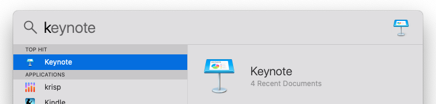
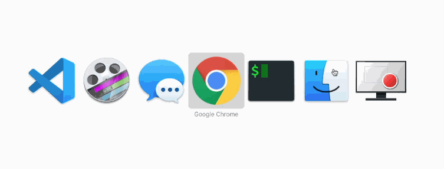
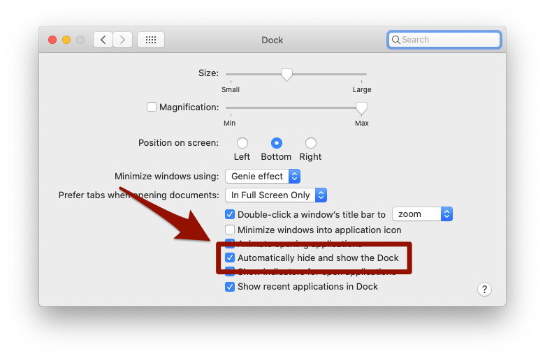
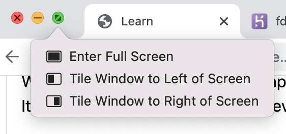
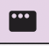
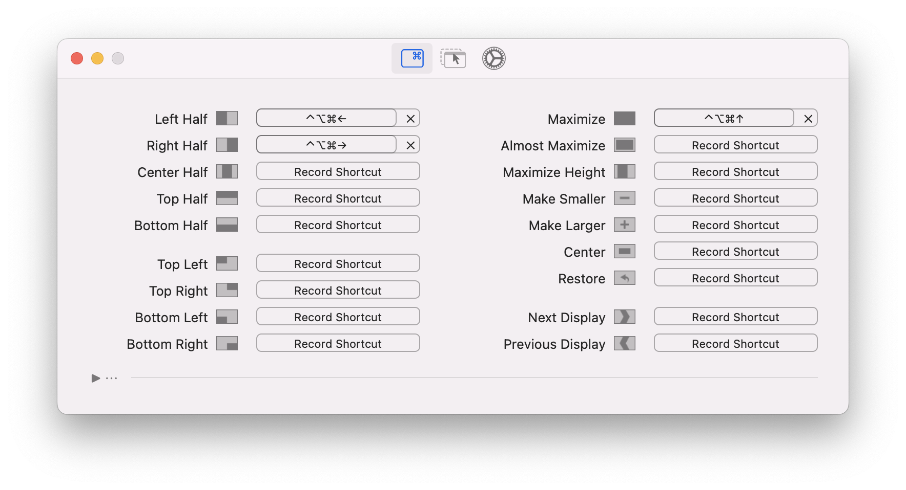
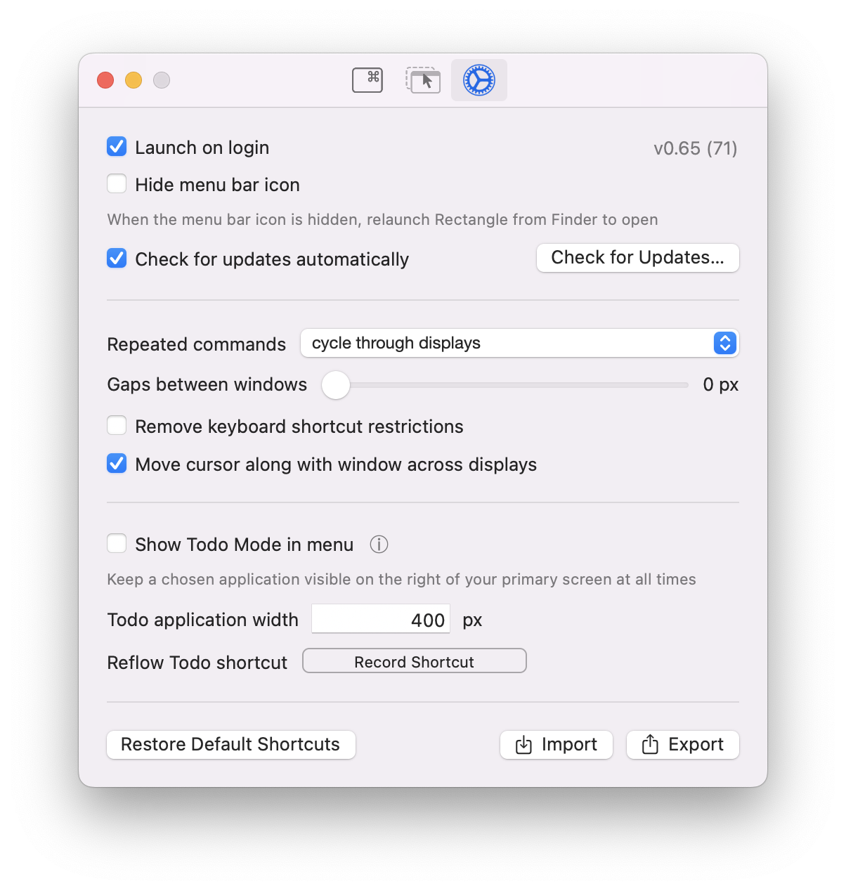
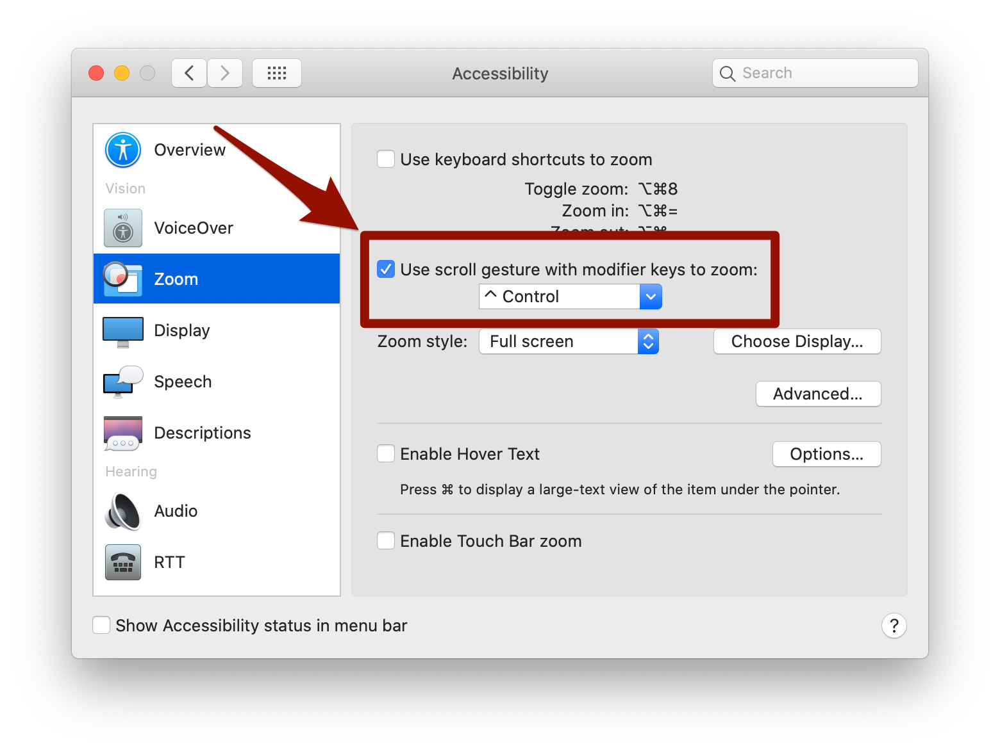
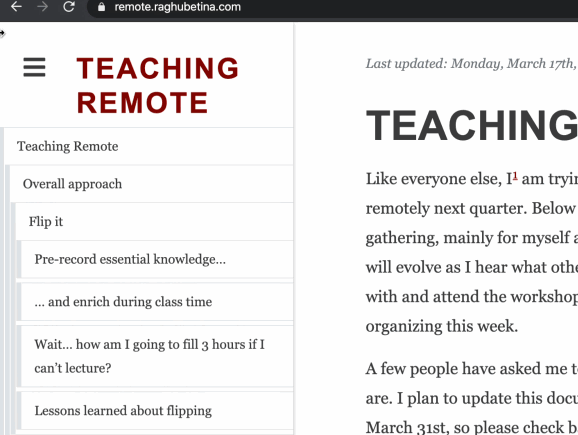

# Mac tips

## Trackpad
### Two-fingers to scroll
One of the most important things to get into the habit of on Macs with trackpads is sliding with two fingers to scroll.

Macs do not, by default, display a scroll bar. (You can and should change that setting to “Always show scroll bars”.) Even when the scroll bar is visible, it is inefficient to click-and-drag to scroll.

Instead, you should hover over any part of whichever window or area that you want to scroll, and slide two-fingers up or down on your trackpad to scroll.

### Manage your other trackpad settings
I personally don’t like any other trackpad gestures except for two-fingers to scroll. I find that pinch to zoom, rotate, swipe between pages, etc, are all more trouble than they are worth — so I disable all of them.

Visit Trackpad in System Preferences and check out the available gestures. Re-visit from time to time as you become more comfortable with your Mac and develop your own taste.

### Become a keyboard ninja
The more adept you are at navigating your computer, the better. When you’re working at your computer 8 hours a day, learning to save a second here and there adds up to huge time savings and productivity gains. More importantly, it reduces the friction involved with experimenting with multiple different approaches to solving a programming problem.

The most important thing to practice in that regard is keyboard shortcuts. **Our goal should be to touch our mouse as little as possible.**

## Use Spotlight to launch apps
You should use Spotlight to search for and launch apps. The magnifying glass in the top-right corner of your screen will launch Spotlight — but don’t click on it! Instead, use the keyboard shortcut: ⌘+Space

This will bring up Spotlight, which is a global search bar for everything on your computer. Start typing the first few letters of the app you want to launch:

Use the up and down arrows to select the app you want, hit return, and away we go! No more hunting through Finder.

## Use the App Switcher
If you can’t touch your mouse, how can you switch between apps/windows?

You should use the App Switcher:

If want to toggle between open apps with the App Switcher, use the following keyboard shortcuts:

Toggle between apps: ⌘+tab. This is the biggie. Some other nice, related ones include:

While holding ⌘ down, keep tapping tab to cycle through open apps.

While holding ⌘ down, tap shift and tab to step backwards.

You can also press Q while an app icon is selected to Quit that app. Prune your running apps often.

Also very important is switching between windows of the same app, and tabs within the same window:

Switch between windows within an app: ⌘+`

You should use this a lot to switch between Chrome windows.
Switch between tabs within a window:

⌥+⌘+←

⌥+⌘+→

Or jump straight to a tab number, e.g. ⌘+4

You should use these a lot to switch between our Gitpod editor, the target, the project notes, the app preview, /git, etc, within the same Chrome window.

(There are equivalents on Windows of most of the above, with Ctrl instead of ⌘. Look around.)

No more dragging windows around or clicking on tabs to find something. Thank goodness!

Other keyboard shortcuts
Review other Gitpod/VSCode-specific keyboard shortcuts here, and start practicing them.

Maximize screen real estate
We have such a tiny window, our laptop screen, through which we practice our craft. It’s very important to make use of every square inch of it.

## Use your external monitor
Screen real estate is so important to developers that most professional developers use at least one external, ultra-wide monitor (or even 2, 3, or more of them). In my home office I have a 49” and a 38” external monitor.

We have so many windows to juggle — your code editor, your app preview, the videos, written notes, etc. And in many cases, it’s helpful to see more than one of them at the same time — most importantly, your editor and the videos. So it’s essential that get into the habit of using your external monitor. We got them for you for a reason.

Remember that you need to tell your Mac which side of your main display the external display is sitting on, so that it can make your mouse move correctly across both monitors.

Open System Preferences and select Displays.

Find “Arrangement” and drag the box representing your external display to the side of your main monitor that you’ve placed it on.

Hide your dock (Mac)
The Dock on Mac takes up way too much space. In your System Preferences, make it go away when your mouse is not hovering at the bottom of the screen:

## Use a window manager
Now that the Dock is out of the way, you should make whatever app you are working within occupy the whole screen. Don’t waste precious inches around the edges.

One, not very useful way of doing this is by clicking the green circle in the top-left corner of our windows:

But these built-in options on Mac are not very good. In particular, “Enter Full Screen” makes it hard to bounce between other apps/windows, which we will need to do frequently. So avoid using Mac’s “Full Screen”.

Instead, we will make the window take up all the available space, without entering Full Screen. You could do this by clicking and dragging each edge, but that is tedious. Instead, we should use a window manager.

Windows has nice window management features built-in, but Macs do not, for some reason. So, we should install a third-party app for window management.

There are many third-party apps that solve the problem; we’ll use Rectangle, which is free.

## Download Rectangle.

Double-click on the .dmg file and drag it into the Applications folder to install it.

Find the Rectangle icon in your toolbar, click it and select “Preferences”:

On the first screen, you’ll see there are a bunch of preset window sizes along with keyboard shortcuts to quickly make your current window snap to each size. Over time, you will develop your own preferences for keyboard shortcuts. For now, I recommend starting with just these:

Maximize: ⌃+⌥+⌘+↑
Left half: ⌃+⌥+⌘+←
Right half: ⌃+⌥+⌘+→
Your shortcuts should look like this:

Next, tweak Rectangle’s settings to look like this:

Give your new shortcuts a try! You can also click-and-drag a window to near the right or left side of the screen in order to snap it to that half.

With your external monitor plugged in, try using the Maximize shortcut twice. It should move the current window to your other screen, and maximize it.

Practice using these shortcuts. From this day forward, I don’t want to see you clicking and dragging windows around, or wasting space around the edges of your windows.

## Zoom in to areas of interest
This isn’t really important for writing software, but if you ever have to do a presentation (likely), here’s a handy tip: you can zoom in on an area of your screen. In System Preferences > Accessibility > Zoom, check the “Use scroll gesture with modifier keys to zoom:” box:

Now, hold down Ctrl and scroll up and down (two-fingers on the trackpad):

You will zoom in and out on your screen, centered wherever your mouse cursor is located. Don’t forget to zoom all the way out when you’re done; it’s easy to forget and then everything will look pixelated and weird.

Voilà! It’s now very easy to call attention to some part of your screen, while also making it easier to read. I use this trick a hundred times a day, as you know.

A note: this trick doesn’t work while screen sharing over Zoom 😔 Your audience won’t see you zooming in and out.

## Prune open windows/tabs
Constantly prune your open windows and tabs. OneTab is a Chrome extension that helps with this; you can save all your open tabs for future reference, but get them out of the way while you’re working.