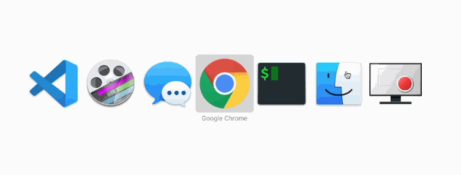
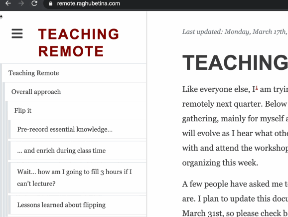

# [Mac tips](https://learn.firstdraft.com/lessons/2)

## Take a screenshot

entire screen (⌘ + shift + 3 )
partial screen (⌘ + shift + 4)

## Trackpad
### Two-fingers to scroll
Hover over any part of whichever window or area that you want to scroll, and slide two-fingers up or down on your trackpad to scroll.

### Manage your other trackpad settings
Visit Trackpad in System Preferences and check out the available gestures.

### Become a keyboard ninja
The most important thing to practice in that regard is keyboard shortcuts. **Our goal should be to touch our mouse as little as possible.**

## Use Spotlight to launch apps
You should use Spotlight to search for and launch apps. The magnifying glass in the top-right corner of your screen will launch Spotlight — but don’t click on it! Instead, use the keyboard shortcut: ⌘+Space

This will bring up Spotlight, which is a global search bar for everything on your computer. Start typing the first few letters of the app you want to launch:

Use the up and down arrows to select the app you want, hit return, and away we go!

## Use the App Switcher
If you can’t touch your mouse, how can you switch between apps/windows?

You should use the App Switcher:

If want to toggle between open apps with the App Switcher, use the following keyboard shortcuts:

Toggle between apps: ⌘+tab. This is the biggie. Some other nice, related ones include:

While holding ⌘ down, keep tapping tab to cycle through open apps.

While holding ⌘ down, tap shift and tab to step backwards.

You can also press Q while an app icon is selected to Quit that app. Prune your running apps often.

Also very important is switching between windows of the same app, and tabs within the same window:

Switch between windows within an app: ⌘+`

### You should use this a lot to switch between Chrome windows.
Switch between tabs within a window:

⌥+⌘+←

⌥+⌘+→

Or jump straight to a tab number, e.g. ⌘+4

You should use these a lot to switch between our Gitpod editor, the target, the project notes, the app preview, /git, etc, within the same Chrome window.

(There are equivalents on Windows of most of the above, with Ctrl instead of ⌘. Look around.)

No more dragging windows around or clicking on tabs to find something. Thank goodness!

## Maximize screen real estate
We have such a tiny window, our laptop screen, through which we practice our craft. It’s very important to make use of every square inch of it.

### Use your external monitor
Screen real estate is so important to developers that most professional developers use at least one external, ultra-wide monitor (or even 2, 3, or more of them). In my home office I have a 49” and a 38” external monitor.

We have so many windows to juggle — your code editor, your app preview, the videos, written notes, etc. And in many cases, it’s helpful to see more than one of them at the same time — most importantly, your editor and the videos. So it’s essential that get into the habit of using your external monitor. We got them for you for a reason.

Remember that you need to tell your Mac which side of your main display the external display is sitting on, so that it can make your mouse move correctly across both monitors.

Open System Preferences and select Displays.

Find “Arrangement” and drag the box representing your external display to the side of your main monitor that you’ve placed it on.

## Hide your dock (Mac)
The Dock on Mac takes up way too much space. In your System Preferences, make it go away when your mouse is not hovering at the bottom of the screen:

You can also use the shortcut ⌘+⌥+D

## Use a window manager
Now that the Dock is out of the way, you should make whatever app you are working within occupy the whole screen. Don’t waste precious inches around the edges.

## Zoom in to areas of interest
This isn’t really important for writing software, but if you ever have to do a presentation (likely), here’s a handy tip: you can zoom in on an area of your screen. In System Preferences > Accessibility > Zoom, check the “Use scroll gesture with modifier keys to zoom:” box:

Now, hold down Ctrl and scroll up and down (two-fingers on the trackpad):

You will zoom in and out on your screen, centered wherever your mouse cursor is located. Don’t forget to zoom all the way out when you’re done; it’s easy to forget and then everything will look pixelated and weird.

Voilà! It’s now very easy to call attention to some part of your screen, while also making it easier to read. I use this trick a hundred times a day, as you know.

A note: this trick doesn’t work while screen sharing over Zoom 😔 Your audience won’t see you zooming in and out.

## Prune open windows/tabs
Constantly prune your open windows and tabs. OneTab is a Chrome extension that helps with this; you can save all your open tabs for future reference, but get them out of the way while you’re working.
