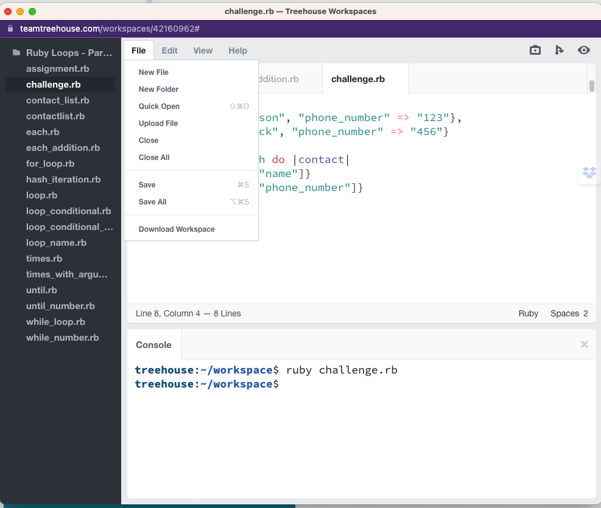

# Running Ruby On Your Own Machine

---

# Why?
<!-- Now that we've been using ruby in gitpod and treehouse it's time to start running ruby on your own machine. -->
1. more typical developer experience
2. helpful for learning
3. fun to start hacking your own scripts


---

# Terminal
open your terminal
<!-- command + space (open spotlight search) -->
<!-- search 'terminal', press `enter` -->

---
# Unix

macOS is in the 'unix' family

<!-- Developed by AT&T Bell Labs in the 1960s and 70s -->


---

# Unix Commands
* `ls` - list directory contents
* `pwd` - print working directory
* `mkdir` - make directory
* `cd` - change directory
* `touch` - updates last open time of file
* `open` - open files and directories
* Use `man` to learn more about each command

---

# Ruby
Ruby comes preinstalled on macOS
* `ruby`
* `ruby --version` or `ruby -v` to check version
This is your system ruby. You'll need to install different versions when developing rails applications. We'll get into this later.
* `gem list` to see all the libraries installed with this ruby

---

## Interactive Ruby (irb)
* type in `irb`
* play around with ruby
* type `exit` to exit irb shell

---

# Setup vscode
vscode is a code editor that works well with ruby, rails, and pretty much any language

* [install vscode](https://code.visualstudio.com/)
* open vscode
* open 'command palette' (command + shift + p)
* add `code` command to your PATH
  * this way we can open vscode from the terminal

---

# Create Workspace Folder
<!-- will use 'folder' and 'directory' interchangeably -->
* create workspace in your root directory `cd ~` then  `mkdir Workspace`
  * capitalize to be consistent with other folders in root
  * generally use lowercase and no spaces
* navigate to workspace `cd Workspace`
* create scratch folder `mkdir scratch`
* open scratch folder in vscode `code scratch`

---

# Create And Run Ruby File
<!-- we should be in vscode scratch folder -->
* `touch hello.rb`
* open `hello.rb` in vscode
  * (command + p) to open search
  * type in filename `hello.rb`
* create program that asks for name and says hello

```ruby
print 'What is your name? '
name = gets.chomp
puts "Hello #{name}"
```

* in the terminal enter `ruby hello.rb`

---

# Create And Open HTML File
* `touch hello.html`
* `command + p` to open command pallete and search hello.html
```html
<h1>hello world</h1>
```
* `open .`

---

# Download Treehouse Workspace
* Click `File`, `Download Workspace`



---

# Resources

## vscode Extensions
[Ruby](https://marketplace.visualstudio.com/items?itemName=rebornix.Ruby)
[HTML CSS Support](https://marketplace.visualstudio.com/items?itemName=ecmel.vscode-html-css)
[GitLens](https://marketplace.visualstudio.com/items?itemName=eamodio.gitlens)


## Ruby Docs
[Ruby Docs](https://ruby-doc.org/)

## Unix
[Commands Cheatsheet](https://www.alexji.com/UNIXCheatSheet.pdf)
