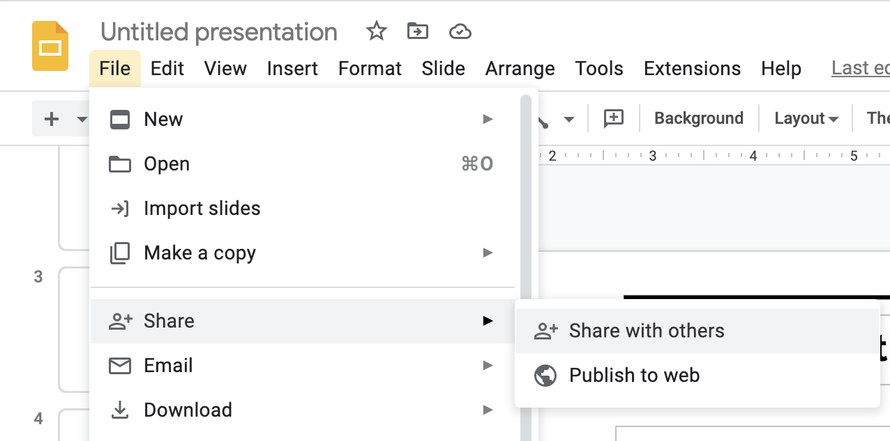
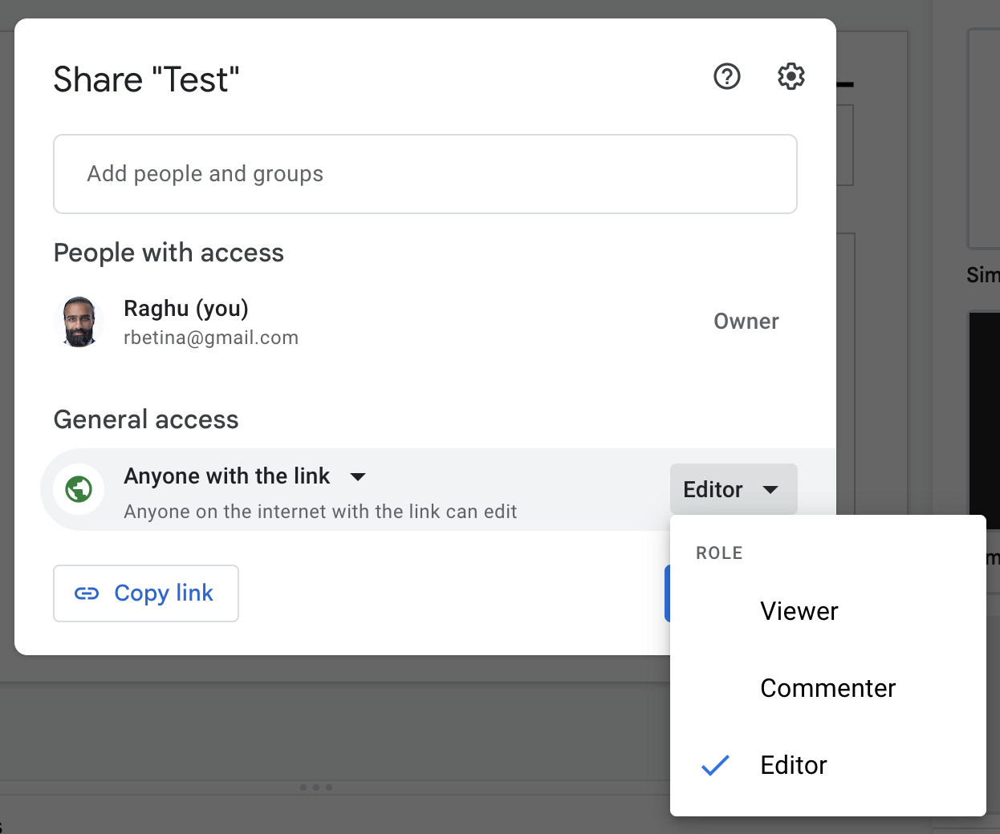
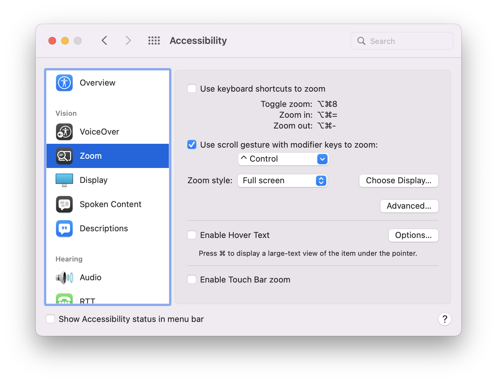

# Guidelines & tips for your Showcase presentation

Here are some guidelines & tips for your presentation:

The goal is to give your friends and family a sense of what you've been doing and what you've gained over the past three months. With that in mind, you're free to present whatever you wish.

You can talk about where you started, why you joined, who you met, what you were hoping for, how it went, kudos for your colleagues, where you want to go from here, or anything else you feel will help tell that story.

A particularly effective way of showing what you've been up to is by including a demo of an app that you've built. More details on that below.

You should submit a first draft of your slide deck no later than Friday the 12th, which is when we'll have our first rapid-fire rehearsals. "Rapid-fire" means you will present to staff, get feedback, make some updates, present again, get more feedback, make updates — rinse and repeat.

You should create slides using Google SlidesLinks to an external site..
We will combine all of your decks into one before the Showcase to ensure smooth transitions.
You can create your own deck, or start from a template that we can provide (ask Tula if you want a template).
If you create your own, stick with the default aspect ratio (widescreen 16x9).
On your first slide, include your name and anything else that you want to be displayed while you're walking up to the stage.
Share your presentation with us by changing the sharing settings to "Anyone with link", copying the share link, and submitting it in this assignment:

Switch to "Anyone with link":

Aim to keep your presentation under 3 minutes.

Practice with each other, and/or in front of a mirror.

If you're presenting an app:
A good baseline structure is: 1) introduce yourself, 2) describe the problem you're trying to solve (a personal anecdote of experiencing the problem is good), and 3) jump into the screencast of the solution you built.

Record a screencast rather than doing a live demo — you don't want to take any risks with e.g. the internet going down.

If you're on a Mac, you can record your screen with QuickTimeLinks to an external site.. On other platforms, you can use ScreencastifyLinks to an external site..

Don't bother including the sign-up/sign-in steps in the video; those will be the same for everyone. Be signed in already and jump straight into the unique parts of the app.

Don't show every single user flow. We don't need to see that you can edit and delete all the things — that is assumed. Focus in on the most interesting/useful flows, or places that were tricky/you're particularly proud of.

It's always nice when demoing for the app to look attractive. Perhaps it's unfair but it's a fact that people don't give as much credit to the same functionality if it doesn't look good. I'm happy to help with CSS/Bootstrap; come grab me and we can pair program.

You can continue to improve your app and re-record your screencast as many times as you like, but the final recording and slides must be submitted on Tuesday, May 16.

General public speaking tips
In your slides, avoid writing out every word that you plan to say. If there's too much text on a slide, your audience will stop paying attention to what you're saying and instead will read the slide.

Instead, consider short bullet points. I use these all the time (as you know) to help me remember what I meant to say, and in what order. But I keep the prompts pretty short, and I use my words to expand.

If you add bullet points, consider animating them to appear one at a time. It helps keep the audience with you, otherwise they will read ahead to the other bullets while you are talking. For example:

To achieve this in Google Slides: right-click and go to "Animate", then under "Object Animations" select "Appear" or "Fade In", then "Onclick", and "By paragraph".

If you are including a screencast, before you start recording, adjust your browser's zoom level to make things as big as you can without making them look awkward.

If you want to also zoom in on just a portion of the screen, the way I do in class, on Mac you enable it in Accessibility Settings:

After you check the box for "Use scroll gesture with modifier key to zoom", you should be able to hold Control while scrolling up and down to zoom in and out.

It can sometimes be hard to conclude a presentation. Consider ending with a firm "Thank you" (as opposed to rambling on for longer than you intend and then closing with "okay I guess that's it!"). Add a closing slide that says "Thank you" to remind yourself of this.

If you forget something you wanted to say, or can't think of a word you want to use, don't panic. Just keep going — your audience will never know, and won't miss a thing.

Most importantly: remember that it will be a room full of people who love and support you and who are already your fans. Try not to stress (I know it's hard), and try to have fun with it!

Please feel free to pepper us with questions or requests for feedback. Thank you!