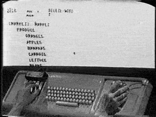

# Terminal

---
# TODO

1. Open terminal to play along

---

# Unix

macOS is in the 'unix' family

<!-- Developed by AT&T Bell Labs in the 1960s and 70s -->

---
# Unix Commands

`ls` - list directory contents

`pwd` - print working directory

`mkdir` - make directory

`cd` - change directory

`touch` - updates last open time of file

`open` - open files and directories (macOS)

`cat` - read file and write to standard output

Use `man` to learn more about command

---
# dot

`.` is shorthand for current path
`..` is shorthand for parent path

can pass `.` or `..` into many unix commands

---
# Autocomplete

**tab**

---
# Cursor

Jump to beginning of line **ctrl + a**

Jump to end of line **ctrl + e**

Move cursor to mouse position **option + click**

---
# History

Use **↑Up** and **↓Down** arrows to scroll through command history

---
# Clear

Clear terminal **⌘ + k**

---
# Get me out of here
Interrupt command **ctrl + c**
  * useful when killing a server instance

Exit [vi](https://en.wikipedia.org/wiki/Vi) interface **q** or **: + q**

---
# Resources

[Unix Commands Cheatsheet](https://www.alexji.com/UNIXCheatSheet.pdf)

[Terminal Tips & Tricks](https://chapters.firstdraft.com/chapters/834)
