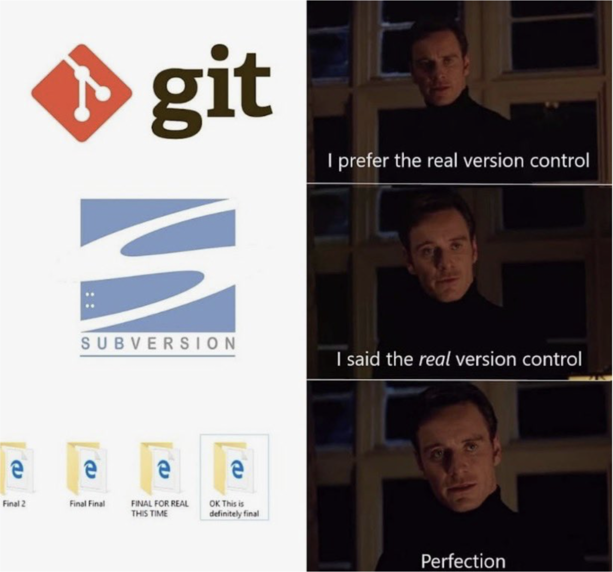
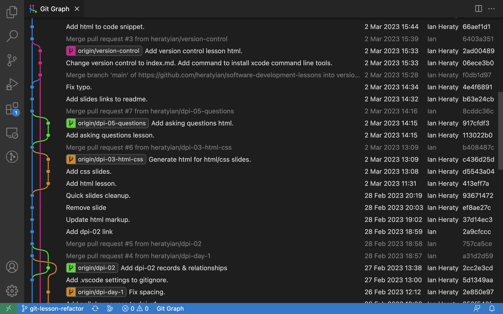
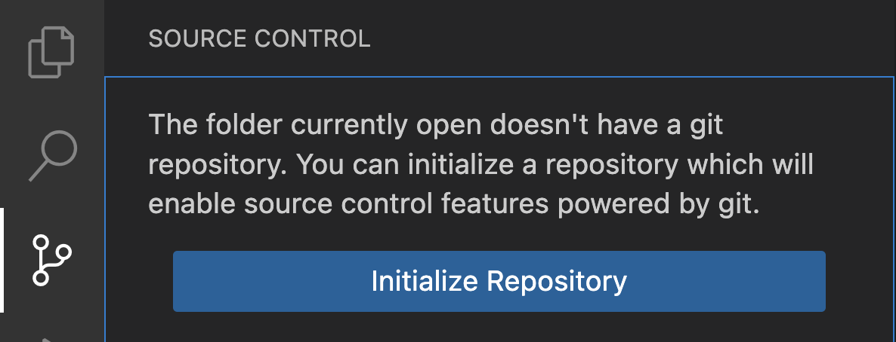
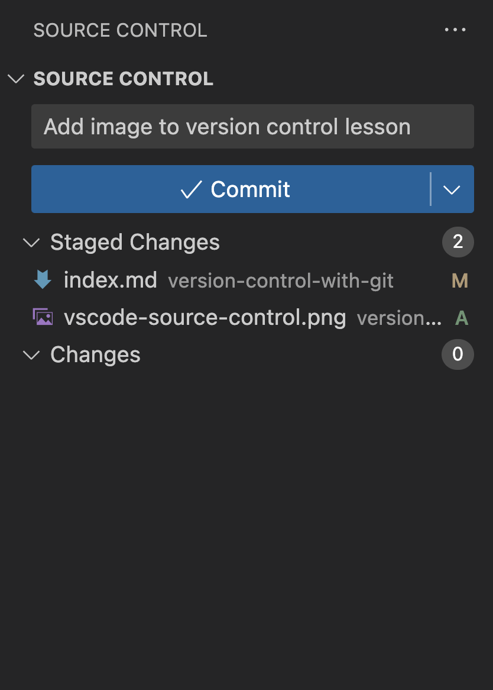
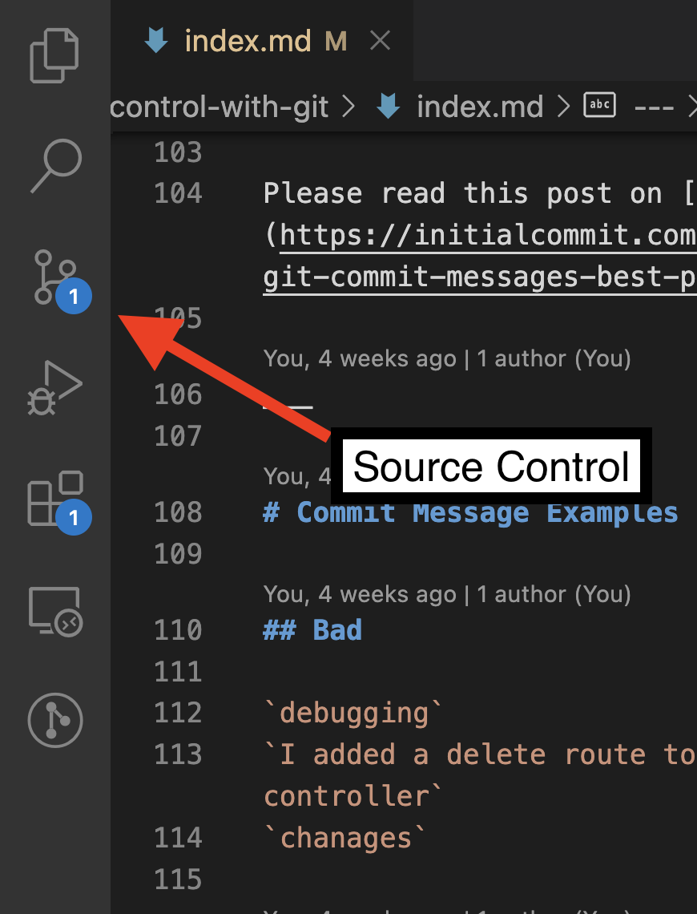

# Version Control
how to track what changed, who changed it, and why

---

# TODO
✅ Setup git to track changes in your `notes/` directory

(you will need install xcode command line tools `xcode-select --install`)

✅ Make a commit

✅ Try using the source control tab with [GitLens](https://open-vsx.org/extension/eamodio/gitlens) extension in VSCode and GitPod workspaces

---

---

# Git is used by >90% of Fortune 100[*](https://octoverse.github.com)

---

# Scenario
* You're a software engineer working on a new feature 🧑‍💻
* You start writing code ✍️
* The app suddenly stops working ⚠️
* You try to remember which files you changed 🤷
* You wish there was an easy way to see and undo your changes 🧞‍♀️

---

---

---

# Terms

**Repository**
tracks and saves history of changes in a git project

**Commit**
a snapshot in the repository timeline

**Branch**
an independent version of the repository

**Merge**
a git command that combines 2 branches into 1 branch

---
# Git CLI (Command Line Interface)

`git init` create an empty Git repository or reinitialize an existing one

`git status` see status of this repository

`git log` show commit logs

`git add` add file contents to the index

`git commit` record changes to the repository

`git branch` list, create, or delete branches

`git merge` join two or more development histories together

`git reset` reset current HEAD to the specified state

(😅 that's a lot to remember. we can just use VSCode for now 😎)

---
# Initialize a local git repository (CLI)

In order to track changes in your `notes/` directory

1. Open a terminal and navigate to your `notes/` directory

2. Type in `git init` to setup a new git repository

    This command creates a `.git/` folder to track changes

---

# Make a commit (CLI)

1. Use `git add` to stage files you want to commit

    `git add .` If you want to add everything

2. `git commit -m "Initial commit"`

---
# Initialize a local git repository (VSCode)

This creates a `.git/` folder to track changes

---
# Make a commit (VSCode)

1. Open source control panel
2. Stage changes
3. Enter commit message
4. Click '✓ Commit'

---
# Commit Message

Commit messages help a future reader quickly understand what changed and why it changed

Please read this post on [Best Practices](https://initialcommit.com/blog/git-commit-messages-best-practices)

___

# Commit Message Examples

## Bad

`debugging`
`I added a delete route to the accounts controller`
`chanages`

## Good

`Enable logging globally`
`Add account delete route`

___

# Git GUI Tools
I **highly** recommend using a git GUI tool

VSCode source control with [GitLens](https://open-vsx.org/extension/eamodio/gitlens)

[Sourcetree](https://sourcetreeapp.com)

[GitHub Desktop](https://desktop.github.com/)

---
# Resources

[First Draft: Using Git](https://chapters.firstdraft.com/chapters/839)

[First Draft: Command Line Git](https://chapters.firstdraft.com/chapters/859)

[GitLens VSCode extension](https://marketplace.visualstudio.com/items?itemName=eamodio.gitlens)

[Git Cheatsheet](https://education.github.com/git-cheat-sheet-education.pdf)

[First Draft: Git Aliases](https://chapters.firstdraft.com/chapters/857)
