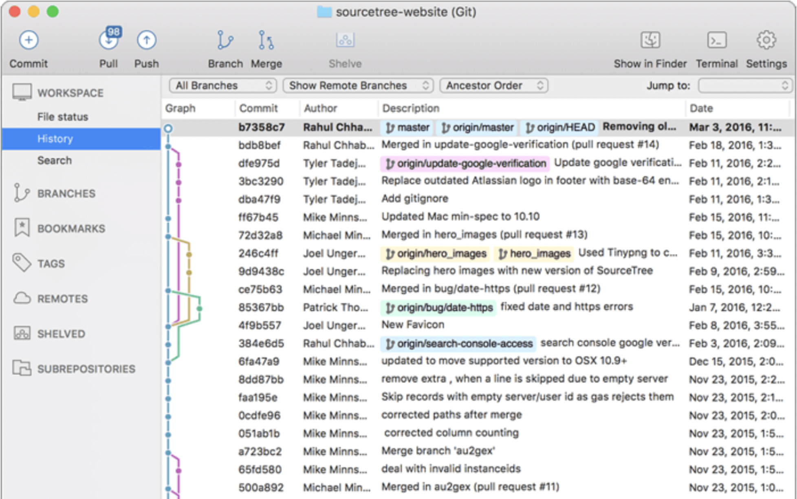
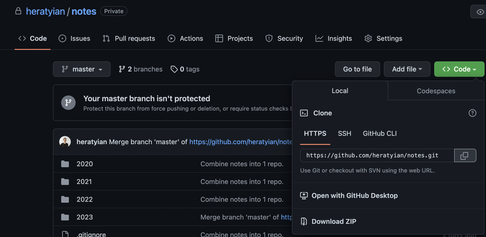

# Version Control
how to track what changed, who changed it, and why

---

# TODO
* setup git to track changes
  * install xcode command line tools
* store your notes in a remote repository on GitHub

---

---

# Git is used by >90% of Fortune 100[*](https://octoverse.github.com)

---

# Scenario
* You're a software engineer working on a new feature 🧑‍💻
* You start writing code ✍️
* The app suddenly stops working ⚠️
* You try to remember which files you changed 🤷
* You wish there was an easy way to see and undo your changes 🧞‍♀️

---

---

---

# Terms

* **Repository**
tracks and saves history of changes in a git project

* **Commit**
a snapshot in the repository timeline
* **Branch**
an independent version of the repository
* **Merge**
a git command that combines 2 branches into 1 branch

---

# Initialize a local git repository

* We will be tracking changes in your `notes/` directory
* Open a terminal and navigate to your `notes/` directory
* Type in `git init` to setup a new git repository

___

# Make your first commit

* Now enter `git status` to see status of this repository
* If you want to add everything in your `notes/`
  * `git add .`
  * `git commit -m "Initial commit"`

---

# Push to GitHub

* Create a new repository in GitHub

`git remote add origin <repository_url>`
`git push -u origin main`

---

---

# Resources

[Sourcetree](https://sourcetreeapp.com)
[git cheatsheet](https://education.github.com/git-cheat-sheet-education.pdf)

