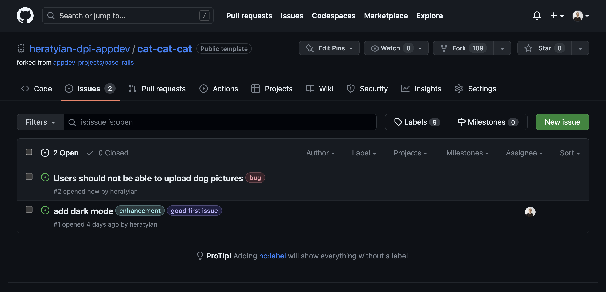
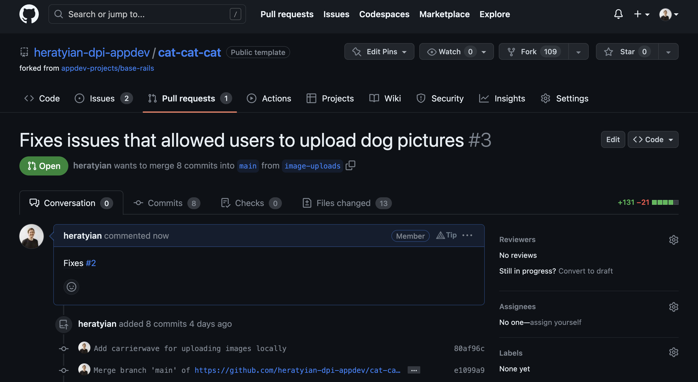
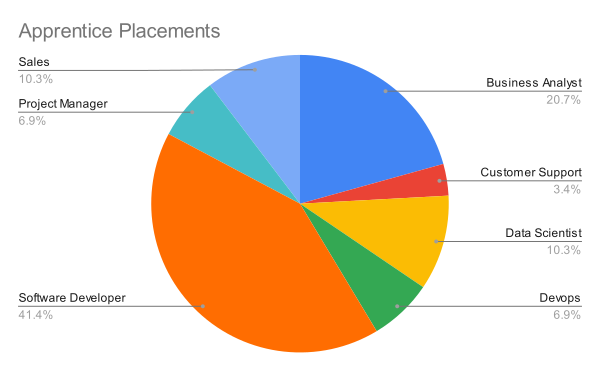

# "Teamwork makes the dream work"

---
# How do you decide what to work on?

* Could use a simple Todo list
* How do you know what is high priority?
* How do you track what other people on your team are working on?
* How do you track thinking behind product decisions?

---

# Issue Tracking

---
# Issue Tracking

---

# Effort vs Impact

---
# Estimating Work
https://www.pointingpoker.com/

- 1 Point: a straightforward task that requires minimal implementation and integration effort. (half workday)

- 3 Points: involves some additional functionality, but is still relatively simple to implement. (1-2 workdays)

- 5 Points: involves moderate effort. (3 workdays)

- 8 Points: requires a significant amount of effort. (~5 workdays)

- 13 Points: a more challenging and time-consuming task. (~10 workdays)

---
# Pointing Poker

As a user, I want to be able to search for products by their name, so that I can quickly find the items I'm interested in.

---

# Pointing Poker

As a user, I want to be able to register with my email and password, so that I can create an account and access the application.

---
# Pointing Poker

As a user, I want to receive email notifications whenever my order status changes, so that I can stay updated on the progress of my purchases.

---
# Pointing Poker

As a user, I want to be able to upload a profile picture, so that I can personalize my profile.

---
# Pointing Poker

As a user, I want to be able to create and manage multiple shopping lists, so that I can categorize my desired items for different occasions or stores.

---
# What are the most common apprentice roles?

* Software Developer
* Business Analyst
* Data Scientist
* Sales
* Devops
* Project Manager
* Customer Support

---

---
# Typical Roles on a Software Team

## Software Developer
* Writes code to create software applications

### Specialties
* Frontend
* Backend
* Mobile
* Integrations
* and more...

---

# Typical Roles on a Software Team

## UI/UX Designer
* Responsible for creating wireframes and prototypes, as well as helping to design the look and feel of your app.

## Quality Assurance Engineer and Tester
* Tests the software applications to ensure that they meet the requirements and are free from bugs

---

# Typical Roles on a Software Team

## Project Manager
* Oversees the software development project from start to finish

## Product Owner / Business Analyst
* Defines the product vision and ensures that the software development team is building the right product

---
# Adjacent roles you might see

## DevOps
* Deploys, monitors, and maintains the software applications and infrastructure

## Data Scientist
* Analyzes and interprets data to gain insights that can be used to inform business decisions

---

# Adjacent roles you might see

## Sales
- Identifies potential customers, builds relationships with them, and sells the software product

## Marketing
- Promotes the software product and builds brand awareness

## Support
- Assists customers with their inquiries, technical issues, and concerns

---

# Thank you

